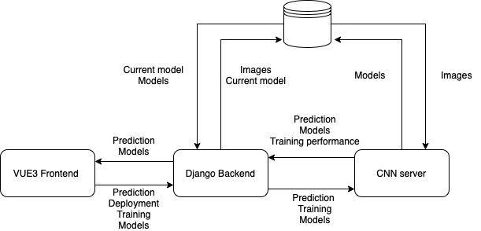
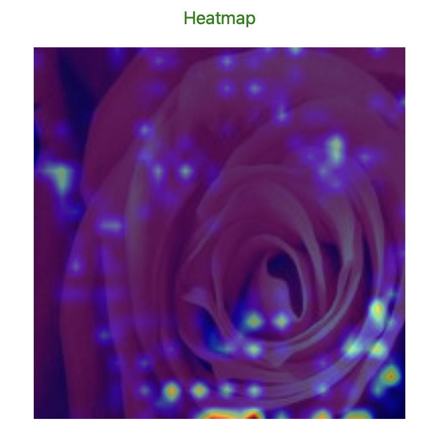

  

# FlowerLens

  

# Purpose

- FlowerLens is a web application that allows users to upload images of flowers and identify the species, offering useful information on how to care for it 

  

  

  

  

● **Scrum Developers:**

  

  

- Albin Karlsson

  

  

  
  

- Ergi Senja

  

  

  

- Erik Lindmaa

  

  

  
  

- Juan García Díaz

  

  

  

- Labiba Karar Eshaba


  
- Victor Campanello
  

  

  

● **Relevant Links**:

  

  

  

  

  

● **Source code and repositories:**

  

  

  

- Main Repository (documentation): https://github.com/ErgimanGU/FlowerLens

  

  

  

- User and Admin Frontend: https://github.com/ErgimanGU/FlowerLens/tree/main/flowerlens-frontend

  

  

  

- Backend: https://github.com/ErgimanGU/FlowerLens/tree/main/flowerlens-backend

  

  

  

- ML model: https://github.com/ErgimanGU/FlowerLens/tree/main/flowerlens-cnn-model
  

# Software Requirement Specification (SRS):

  
Admin UI requirements:

1.  The admin shall be able to login.    
2.  The admin shall be able to upload images for retraining the model.    
3.  The admin shall be able to view the performance metrics of the model.
4.  The admin shall be able to see the accuracy, recall, precision and F1-score of the model.
5. The admin shall be able to select which model to deploy.
6. The admin shall be able to rollback a model.    
  

User UI requirements:

1.  The user shall be able to upload a photo of a flower that the user wants to learn about within the application.    
2.  The user shall receive information based on the results produced by the inference model. (identified flower species, map of species habitat, general information, flower cycle, uses in cuisine/medicine, soil, poisonous)    
3.  The user shall be presented with information from reputable sources (cross referenced with LLMs).    
4.  The user shall be able to use the application both in the desktop and mobile    
5.  The user shall be able to understand the results of the inference model using AI explainability techniques (heatmap + how to use page)
  

Backend requirements:
1. The backend system shall handle any request.
2. The backend system shall not crash when a faulty request is made.
3. The backend system shall
4. The backend shall be able to add and edit information in the db.
5. The backend should handle and redirect requests made to the CNN model.

ML model requirements:
1. The system will be able to accept flower pictures of different format (png, jpg)
2.  The system shall be able to accept a wide range of image sizes
3.  The system shall only identify 1 flower per image 
4.  The system shall produce a prediction heatmap to improve AI explainability.
5. Upon request, the system shall train a new model and produce a report detailing different metrics on its performance (precision, recall, accuracy, f1 score and confusion matrix)
  
  
  
  

# Software Architecture Document (SAD)


## System architecture

  

  ### The system is composed by 3 components:
  - The frontend, a Vue3 UI which:
	  - Allows users to upload pictures, make predictions, recieve information, be educated on how AI works
	  - Allows admins to upload training data, view model performance indicators, dynamically train, deploy and rollback models.
- The backend, a Django server which:
	- Takes care of handling frontend requests, some which are redirected to the CNN server (for functionalities related to training and prediction)
	- Takes care of the admin functionalities (retrieving information, editing information, selection of deployed model, etc...)
- The CNN, a Django server which:
	- Dynamically obtains the newest training data 
	- Trains CNN models
	- Produces a perfomance report on new CNN models
	- Predicts flowers upon receiving a picture
	- Produces a heatmap to explain the prediction

  

## ML model specifications
```
 model = Sequential()
 
 # Convolutional layer with more filters
 # kernel size (3x3), and padding
 model.add(Conv2D(32, (3, 3), activation='relu', name='conv1', input_shape=(256, 256, 3)))
 model.add(MaxPooling2D((4, 4)))
 model.add(Dropout(0.25))
 
 # Another pair of convolutional layers with increased filters
 model.add(Conv2D(64, (3, 3), activation='relu', name='conv2'))
 model.add(MaxPooling2D((2, 2)))
 model.add(Dropout(0.25))
 model.add(Conv2D(64, (3, 3), activation='relu', name='conv3'))
 model.add(MaxPooling2D((2, 2)))
 model.add(Dropout(0.25))
 
 # Flattening
 model.add(Flatten())
 
 # Dense layer with more units
 model.add(Dense(512, activation='relu'))
 model.add(Dropout(0.5))  # Dropout for regularization
 
 # Output layer with softmax activation
 model.add(Dense(11, activation='softmax'))  
 
 # Compile the model
 model.compile(optimizer='adam',
 loss='sparse_categorical_crossentropy',
 metrics=['accuracy'])
 
 # Add Early Stopping
 early_stopping = tf.keras.callbacks.EarlyStopping(monitor='val_loss', patience=5)
```
  

## AI explainability

  - To match the advanced AI functionality criteria, we decided to implement a prediction heatmap, which is overlayed on top of the image to showcase areas of interest when making a prediction by locating the selected pixels after multiple layers of convolution.
  - To do so, we used the [Keras Grad Cam](https://keras.io/examples/vision/grad_cam/) functionality.
  - The code is the following:
 ```
def generate_grad_cam(model, image, class_index):
	# Function to generate Grad-CAM heatmap
	 last_conv_layer = model.get_layer('conv3') 
	 heatmap_model = tf.keras.models.Model([model.inputs],[last_conv_layer.output, model.output])
	 with tf.GradientTape() as tape:
		 conv_output, predictions = heatmap_model(image)
		 loss = predictions[:, class_index]
	grads = tape.gradient(loss, conv_output)
	 pooled_grads = K.mean(grads, axis=(0, 1, 2))
	 heatmap = tf.reduce_mean(tf.multiply(conv_output, grads), axis=-1)
	 heatmap = np.squeeze(heatmap)  # Remove the single-channel dimension if present
	 heatmap = np.maximum(heatmap, 0)
	 heatmap /= np.max(heatmap)
	 # Upsample the heatmap to match the original image size
	 upscaled_heatmap = ndimage.zoom(heatmap, zoom=(256 / 39, 256 / 39), order=1)
	 # Overlay the heatmap onto the original image
	 alpha = 0.6  # Set the transparency of the heatmap
	 reshaped_image = np.squeeze(image)
```
  
- Example image:

  

## Technologies, libraries and other resources user in the project:

  

  

  

● User and Admin UI: VUE 3 / Bootstrap / AXIOS


● Backend: Django / PostgreSQL


● ML model: Django / PostgreSQL / TensorFlow / Pandas / Numpy

  

  