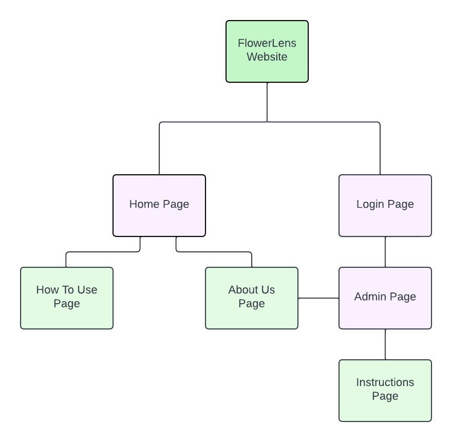
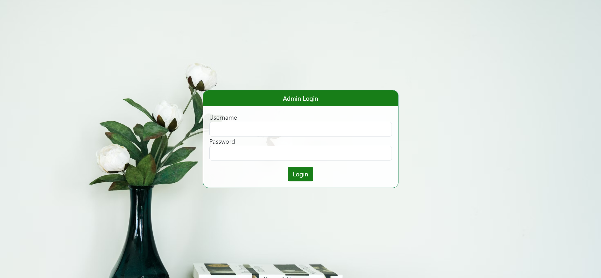
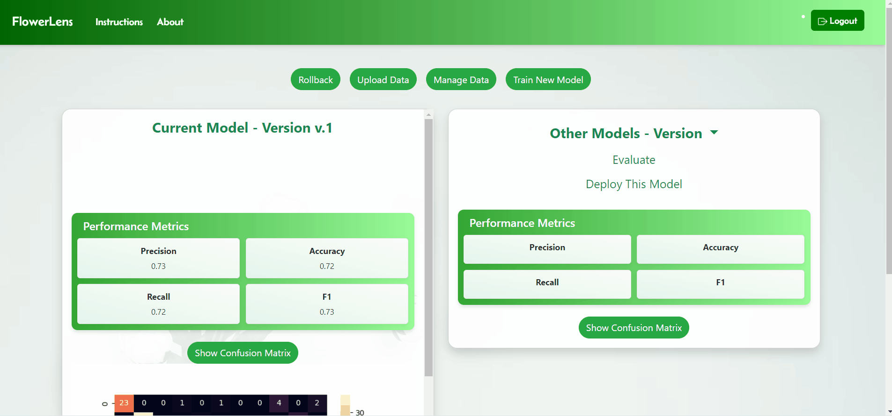
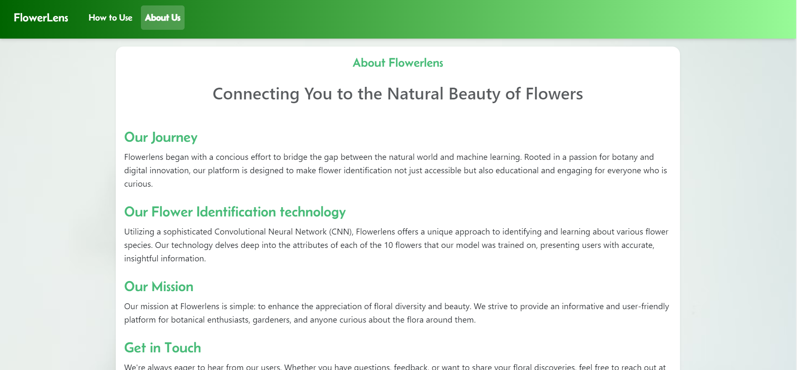

# FlowerLens - Frontend


# User Client
The user client is the component that users and admins directly interacts with. It includes the graphical user interface written with the vue 2 framework, allowing users to use the model and admins to monitor the models performance.

## Technologies
- Vuejs 3
- Bootstrap 5.3
- Axios
- Kubernetes  

## Dockerization

Our application is dockerized. It can be located at our [container registry](https://git.chalmers.se/courses/dit826/2023/group4/flowerlens-frontend/container_registry/1117). The docker images take the name of the branch. The main branch(docker image) contains the endpoints for the deployed version of our app(kubernetes deployment) and the branch named "local_development" contains the local endpoints.


## Visuals Diagram

The following diagram shows a prototype of the different pages and how they are connected to each other.

    
Figure:  FlowerLens Sitemap 


#  Installation Instructions

## Prerequisites


Before you begin, ensure you have the following installed:
- Nodejs
- The IDE of your choice
- A modern browser

## Steps to run the application

To run the application for development you need to follow these steps:

- Clone the repository on your device
- Open a terminal and navigate to the root folder with the command "cd client"
```bash
cd Frontend/flowerlens
npm install
npm run dev
```

## Usage:

### Homepage - 
The prediction and identification of the flower uploaded by the user takes place in the home page. This page provides the user with what the uploaded flower is alongside additional information such as it's scientific name, temperature it grows in etc. Moreover, it also provides users a heatmap of the identified flower.


### How To Use - 
This page acts as a guide for the homepage and gives the user a overview of how the homepage can be used.


### Admin Login -
The Login page acts as an authentication point to the Admin page. When a user logs in and gets authorized, then the user is recognized as an admin and gets to access the Admin page.


### Admin Page -
The Admin page is where the admin manages and uploads data. Moreover the admin can select, compare, train and deploy models. This page also provides the admin an image of confusion matrix for respective models.
 

### Instructions Page -
This page acts as a guide for the admin page and gives the admin a overview of how the homepage can be used.


### About Us Page -
This page describes our mission, who the website is for and our technology. 



## Authors and acknowledgment Authors

### The code and documentation included in this repository was authored by:
- Ergi Senja 
- Juan Garcia Diaz
- Labiba Karar Eshaba 


## License

This project is part of the course DIT826 for **Gothenburg university**.
Use is only allowed for the examiners or developers of this project.
